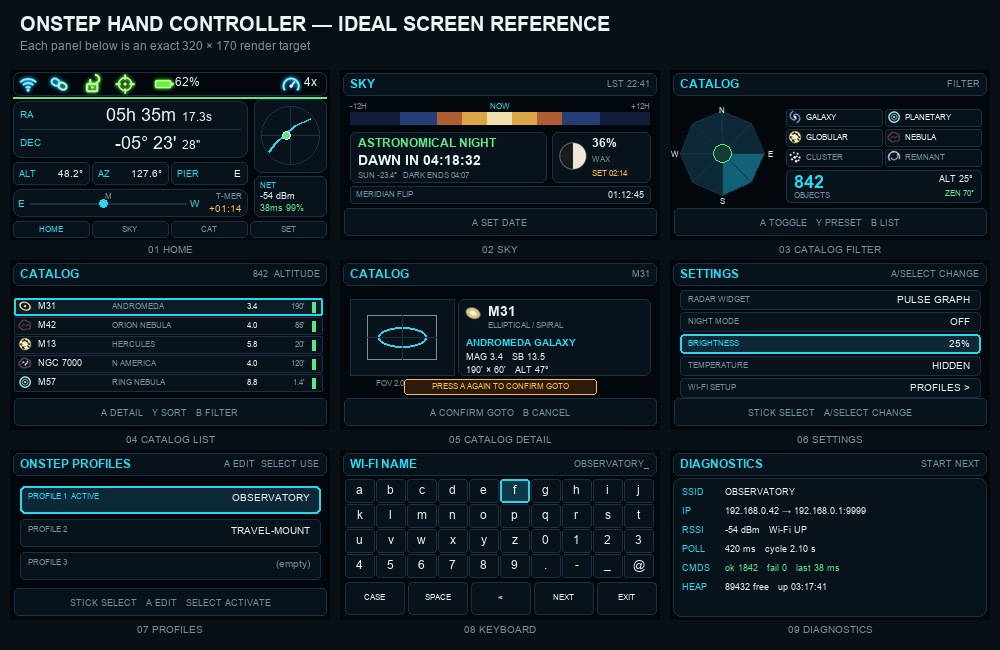
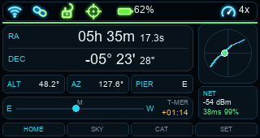
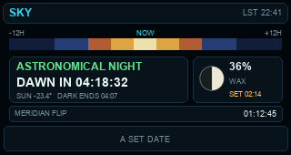
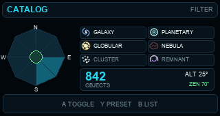
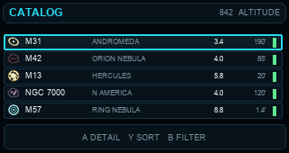
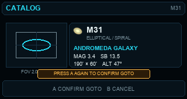
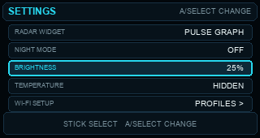
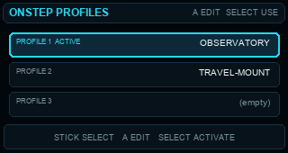
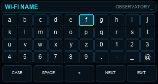
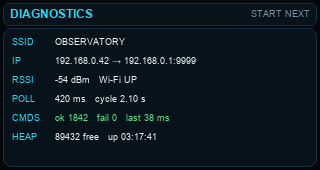

# OnStep Advanced Telescope Controller — User Guide

This guide describes the controls and screens in the current 320×170 LVGL
firmware. All menus remain usable when Wi-Fi or OnStep is disconnected. Mount
commands naturally require a live connection.

The images are visual targets rather than captured LVGL frames. Each individual
PNG in `docs/screen_mockups` is exactly 320×170, making it easy to compare with
a photograph of the real display.

## Controls at a glance

| Control | Short action | Hold for at least 0.6 seconds |
|---|---|---|
| **START** | Next main screen | Toggle day/night mode |
| **SELECT** | Open Settings from Home/Diagnostics; otherwise select like A | **Emergency stop** (`:Q#`) |
| **A** | Choose, change, open, or confirm the highlighted item | No assigned action |
| **B** | Back/cancel in Catalog; cancel Sky date editing | No assigned action |
| **Y** | Catalog preset or sort | No assigned action |
| **X** | Reserved | No assigned action |
| **Joystick** | Navigate; on Home, manually slew the mount | After 450 ms, menu/keyboard movement repeats every 150 ms |
| **Enclosure button 1 / GPIO0** | Same as A | — |
| **Enclosure button 2 / GPIO14** | Next main screen | Deep sleep |
| **RESET** | Restart; also wakes from deep sleep | — |

Returning the joystick to center stops a manual slew. Changing direction stops
the old direction before starting the new one.

## Main-screen order

Press **START** or briefly press enclosure button 2:

`HOME → SKY → CATALOG → SETTINGS → DIAGNOSTICS → HOME`

Short **SELECT** is a direct Settings shortcut from Home or Diagnostics. The
controller does not need to be connected to OnStep to move through these
screens, edit settings, or browse the catalog.

## Home

Home is the live mount dashboard.

- The top row shows Wi-Fi, OnStep link, park, guide-pulse, battery, optional
  chip temperature, motion state, and slew rate.
- RA and Dec are the mount's reported coordinates. Dim text or the refresh mark
  means the data is offline or stale.
- ALT, AZ, and PIER show the current mount geometry.
- The E–M–W bar is the hour-angle position. `T-MER` is time to meridian;
  negative means the target has passed it.
- The lower-right card normally shows connection strength, latency, and command
  success. During a reported guide pulse it becomes an honest pulse-presence
  trace.
- Move the joystick on this screen to manually slew north, south, east, or
  west. This is the only screen where the joystick commands mount motion.

The upper-right widget is chosen in Settings:

- **Sky Track:** a horizon/zenith projection. The dot is the current pointing,
  the faded trail is recent motion, the bright arc is the predicted path, the
  amber part is below the preferred altitude, and the small marker is meridian.
- **Meridian Clock:** shows hour angle and time to transit.
- **Pulse Graph:** blue is signed RA coordinate change and green is signed Dec
  coordinate change while classic OnStep reports a pulse. It does not claim to
  show RMS guiding error.
- **GEM Mount:** a simplified mount pose, pier side, tracking motion, and park
  state.

## Sky

Sky summarizes observing darkness, the Moon, and meridian timing.

- The ribbon covers the 12 hours before and after now. Its colors transition
  through day, civil, nautical, astronomical twilight, and night.
- The main card names the current light regime and counts down to the next one.
- The Moon card shows illumination, waxing/waning state, and rise/set countdown.
- The bottom line shows time to a possible meridian flip.

Press **A** to edit UTC date/time. Move left/right between Year, Month, Day,
Hour, and Minute; move up/down to change the value. Press **A** to accept or
**B** to cancel. Enter UTC—not local civil time.

## Catalog — Filter

The catalog contains 4,271 larger deep-sky objects and keeps 22 visual
subtypes. Filtering makes the list practical on a small screen.

- Move the joystick around the compass sectors, altitude floor, and six object
  groups.
- **A** toggles the highlighted sector/type. On the altitude control, A jumps
  between useful low/high presets; joystick up/down fine-adjusts it.
- **Y** cycles All → East → West → South → All sky presets.
- **B** opens the matching object list.
- The center zenith area remains included so nearly-overhead objects are not
  accidentally lost when using directional sectors.

The six groups are Galaxy, Planetary Nebula, Globular Cluster, Nebula, Cluster,
and Supernova Remnant. Exact subtypes appear in the List and Detail screens.

## Catalog — List

- Joystick up/down changes the selected object.
- Joystick left/right moves by a page.
- **A** opens the selected object's detail screen.
- **Y** cycles the sort mode.
- **B** returns to filters.

Each row shows its catalog designation, common name where available, magnitude,
angular size, subtype glyph, and a compact altitude indicator.

## Catalog — Object detail and GoTo

The left box compares the object's angular size and position angle with the
selected field of view. Move the joystick left/right to adjust that FOV. The
right card shows designation, name, subtype, magnitude, surface brightness,
size, and current sky information.

GoTo is deliberately a two-step action:

1. Press **A** or **SELECT** once to arm the command.
2. Verify the target, then press **A** or **SELECT** again to send it.
3. Press **B** at any time to cancel or return to the list.

The controller sends classic OnStep `:Sr`, `:Sd`, then `:MS`. It refuses GoTo
when OnStep is offline or the mount is parked. Always verify that the telescope
has a safe physical path and that limits are configured before confirming.

## Settings

Move up/down and press **A** or **SELECT** to change the selected row.

- **Radar Widget:** Sky Track, Meridian Clock, Pulse Graph, or GEM Mount.
- **Night Mode:** switches the interface to its red observing palette.
- **Brightness:** 5, 10, 15, 20, 25, 35, or 50%. Default is 25%; 50% is the
  intentional maximum.
- **Temperature:** hidden by default. If shown, it is ESP32 chip temperature,
  not outdoor temperature.
- **Wi-Fi Setup:** opens the saved mount profiles.

Widget, night mode, brightness, temperature visibility, active profile, SSIDs,
and passwords are persisted in ESP32 NVS and survive sleep or power loss.

## OnStep profiles

Up to three mount Wi-Fi profiles can be stored. Most owners only need Profile 1.

- Move up/down to highlight a profile.
- Press **A** to create or edit it.
- Press **SELECT** to activate a configured profile.
- Selecting an empty profile opens the keyboard automatically.

After changing the active network, restart if the current connection does not
move to the new mount immediately.

## Wi-Fi keyboard

- Move the joystick to highlight a key; the active key blinks.
- Tap **A** or **SELECT** to enter it.
- **CASE** cycles lowercase, uppercase, and number/symbol layouts.
- **SPACE** inserts a space; **<** removes the last character.
- Enter the Wi-Fi name and choose **NEXT**, then enter the visible password and
  choose **ENTER** to save it.
- Choose **EXIT** to return without saving.

A short stick movement advances one key. Holding beyond 450 ms begins a
controlled repeat every 150 ms. SSID and password fields accept up to 63
characters.

On a completely unconfigured first boot, the temporary
`OnStep-Remote-Setup` access point/web page remains available as a fallback.

## Diagnostics

Diagnostics is intentionally last in the normal screen cycle. It reports SSID,
local and mount addresses, RSSI, Wi-Fi state, polling/cycle timing, command
success/fail counts, last latency, free heap, and uptime. Use it when the Home
link icon stays disconnected or values stop refreshing.

For deeper bring-up, connect USB serial at 115200 baud and type `help`. The
`pad` command checks live seesaw input; boot messages report whether the gamepad
was found at address `0x50` and which SDA/SCL pair worked.

## Power and emergency behavior

- Hold enclosure button 2 for at least 0.6 seconds to enter deep sleep. GPIO14
  or RESET wakes it. Deep sleep is very low power but is not a true electrical
  disconnect; only a physical battery switch provides zero drain.
- Hold **SELECT** for at least 0.6 seconds to send the global OnStep stop command
  `:Q#`. This aborts motion; it is available regardless of the displayed screen.
- RESET restarts the controller; it is not a graceful power-off switch.

## Photograph checklist

For useful comparisons, photograph Home, Sky, all three Catalog views,
Settings, Profiles, Keyboard, and Diagnostics. For each photo:

- shoot straight-on so the 320×170 panel is not trapezoidal;
- turn off camera HDR/night mode if it smears fine red lines;
- capture day mode at 25% brightness and night mode at 10% or 15%;
- include one connected Home shot and one offline Home shot;
- note any clipped text, unreadable glyph, unexpected color, flicker, or wrong
  control behavior next to the photo.
